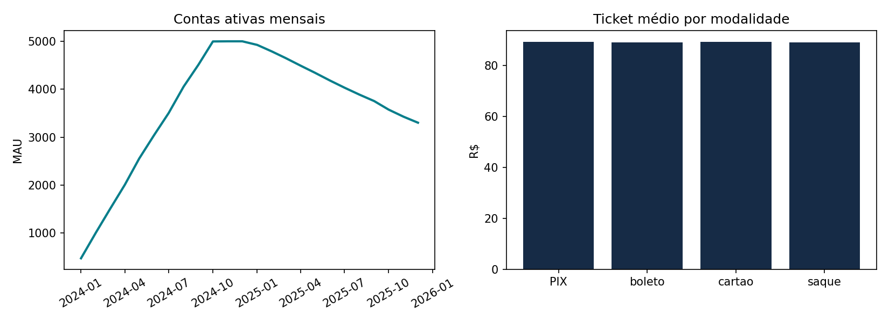
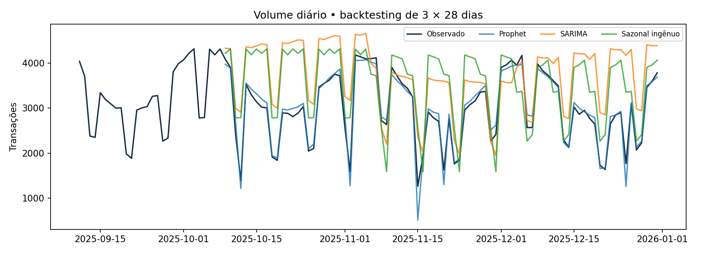
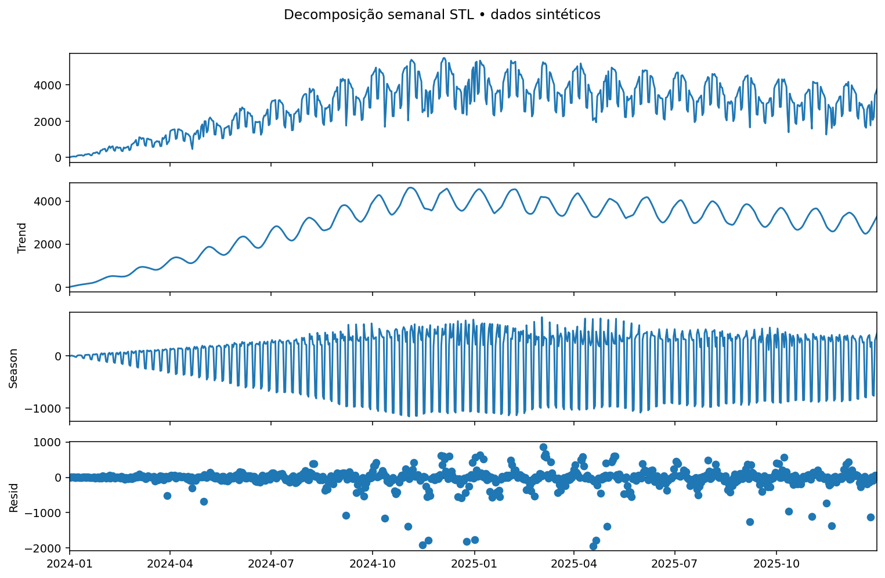
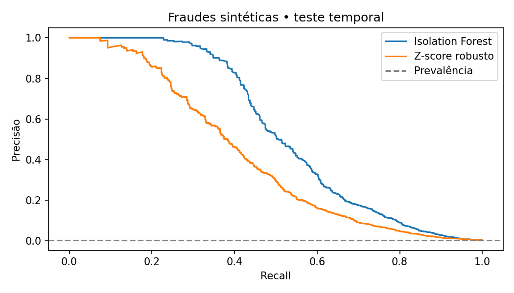
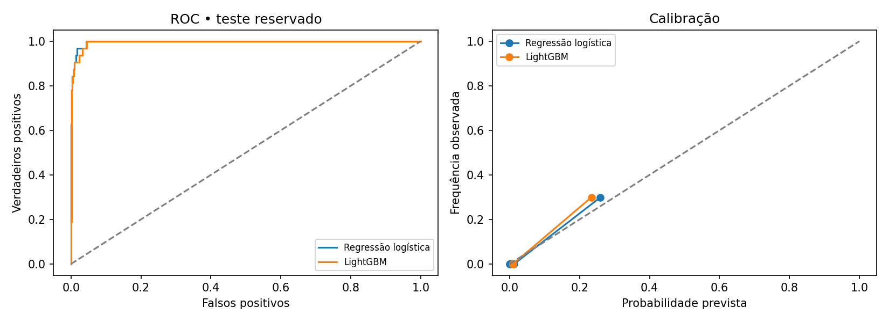
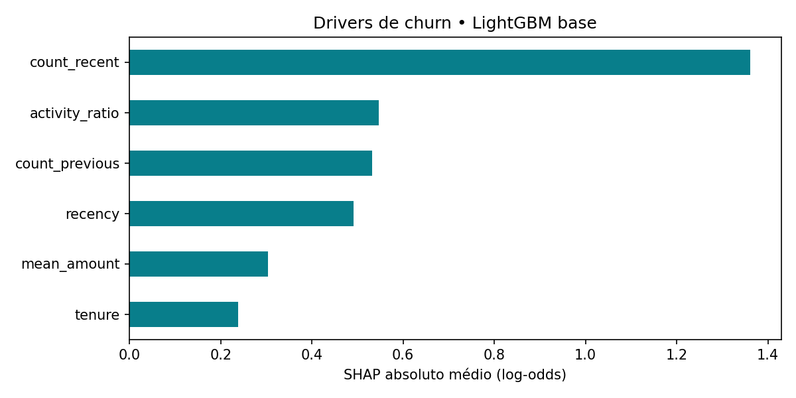

# Digital Account Analytics

**Da movimentação diária à decisão: previsão de demanda, investigação de anomalias e priorização de retenção em contas digitais.**

[](https://github.com/JoaoMattos/digital-account-analytics/actions/workflows/ci.yml)


> **Todos os dados são sintéticos.** Não há clientes, transações ou informações bancárias reais. Os resultados medem a recuperação de padrões programados na simulação; não demonstram desempenho em produção nem ganhos financeiros realizados.

## O problema de negócio

Uma operação de contas digitais precisa responder a três perguntas: **quanto volume esperar**, **quais transações investigar** e **quais contas priorizar em uma ação de retenção**. Uma mesma base conecta SQL e estatística a modelos preditivos e a um agente que explica os resultados com evidências consultáveis.

A história da simulação começa com aquisição de contas, passa por crescimento de uso e termina com perda de atividade em parte da base. Contar cadastros esconderia esse movimento: no encerramento, **34,06% das contas estavam sem transacionar nos últimos 30 dias**. MAU e retenção por coorte tornam essa diferença visível.



## Dados e reprodução

`src/data/generate.py` gera **5.000 contas e 2.115.556 transações**, cobrindo **731 dias, de 01/01/2024 a 31/12/2025**, com seed **42**. O volume monetário sintético é **R$ 188,86 milhões**.

- Atividade diária Poisson, tendência, ciclos semanal e mensal e feriados nacionais brasileiros via `holidays`.
- Aberturas distribuídas nos primeiros 300 dias; parte das contas reduz a atividade antes de se tornar inativa.
- Modalidades PIX, cartão, boleto e saque; valores lognormais e horários de uso.
- **0,2973% de fraudes injetadas**, com alteração de valor e horário. O rótulo serve apenas à avaliação.
- Arquivos `data/accounts.parquet`, `data/transactions.parquet` e banco `data/analytics.duckdb`. A pasta `/data/` é ignorada pelo Git; relatórios agregados e casos sintéticos ficam versionados.

### Executar em três comandos

Com **Python 3.12** disponível, após clonar o repositório e entrar em sua pasta (recomenda-se um ambiente virtual ativo):

```bash
python -m pip install -r requirements.txt
python -m src.pipeline
python -m streamlit run app.py
```

O pipeline gera os dados e todos os resultados sem chave de API. O dashboard abre em `http://localhost:8501`. A execução local de referência levou cerca de **9 segundos**, após instalar dependências; tempo e consumo variam por máquina. Reserve aproximadamente 1–2 GB de RAM. Os notebooks pressupõem a execução prévia do pipeline.

Para criar um ambiente virtual: `python -m venv .venv`; ative com `.venv\Scripts\Activate.ps1` no PowerShell ou `source .venv/bin/activate` no Linux/macOS. `make run`, `make test` e `make lint` são atalhos opcionais onde GNU Make estiver instalado.

## Resultados obtidos

Números abaixo produzidos pelo pipeline completo, sem preenchimento manual de métricas. Fontes: [`summary.json`](reports/summary.json) e tabelas CSV em [`reports/`](reports/). Pequenas diferenças numéricas entre plataformas são possíveis.

### 1. SQL e estatística: mensurar antes de modelar

Consultas SQL puro calculam **DAU, MAU, ticket médio e retenção por coorte de abertura**. Retenção é o número de contas da coorte que transacionaram no mês dividido pelo tamanho original da coorte; não é retenção condicional ao mês anterior. Meses futuros são ausentes, não zeros.

O ticket médio calculado primeiro por conta e depois entre contas foi **R$ 89,25**, com **IC de 95% [R$ 89,06; R$ 89,44]**. O teste t de Welch entre segmentos retornou **p = 0,0906**; o qui-quadrado entre segmento e inatividade, **p = 0,7414**. Ao nível exploratório de 5%, não encontramos evidência suficiente de diferença/associação nesses testes. Isso é coerente com segmentos sorteados sem efeito no gerador, mas não prova igualdade.

A unidade inferencial é a **conta**, evitando tratar suas transações repetidas como observações independentes. Os testes são exploratórios, sem correção por multiplicidade; o IC usa aproximação t e não representa incerteza de uma população bancária real.

### 2. Séries temporais: o calendário importa

Backtesting com **três janelas expansivas e horizonte de 28 dias**, nos últimos 84 dias da base. A tabela mostra a média das métricas por janela.

| Modelo | MAPE (%) ↓ | RMSE (transações/dia) ↓ |
|---|---:|---:|
| Prophet | **4,61** | **155,73** |
| Sazonal ingênuo | 27,10 | 823,23 |
| SARIMA | 31,40 | 926,35 |



Prophet reduziu o RMSE em **81,08% frente ao baseline**, neste cenário sintético. Ele modela os ciclos semanal e mensal e feriados brasileiros; SARIMA `(1,1,1)(1,0,1,7)` usa apenas sazonalidade semanal e não superou o baseline. O resultado mostra a importância de representar o calendário, não uma superioridade universal do algoritmo.



STL com período 7 é descritivo. A decomposição completa não alimenta previsões. Convergência do SARIMA e resultados individuais estão em [`forecast_folds.csv`](reports/forecast_folds.csv). MAPE protege denominadores com mínimo de 1; a série simulada de referência não contém dias de volume zero.

### 3. Anomalias: acurácia esconderia o problema

Treino em 2024; limiares definidos em janeiro–setembro/2025 pelo percentil **99,7%**; teste em outubro–dezembro/2025. Rótulos de fraude não entram no ajuste nem na escolha do limiar.

| Detector transacional | Precisão | Recall | Average precision | Alertas |
|---|---:|---:|---:|---:|
| Isolation Forest | **50,12%** | **50,60%** | **0,5405** | 838 |
| Z-score robusto | 42,10% | 42,05% | 0,4080 | 829 |



O Isolation Forest recupera aproximadamente metade das fraudes com uma fila de 838 alertas. Cerca de metade da fila ainda é falso positivo: **alerta não é confirmação de fraude**. O notebook inclui transações de maior score e falsos positivos para análise de casos. As métricas usam todo o teste; o arquivo de casos contém somente os 100 maiores scores.

**STL tem outra unidade de análise:** total monetário diário. Quatro choques de 2,5× são injetados somente em uma cópia da série de teste; padrão sazonal e nível são estimados antes do teste. Com limiar fixo 4, o detector alcançou **100% de recall, mas apenas 7,69% de precisão (52 alertas)**. O excesso de alertas é uma limitação explícita: nível congelado e sazonalidade semanal não absorvem todas as mudanças. Não seria uma regra pronta para operação, e seus números não são comparáveis aos de fraude transacional.

### 4. Churn: modelo simples, validação explícita

**Churn = nenhuma transação nos 30 dias após 30/11/2025**, entre contas que transacionaram nos 30 dias anteriores. Features: frequência recente/anterior, razão de atividade, recência, ticket e tempo de relacionamento. Nenhuma feature usa o futuro, o rótulo de fraude ou o dia de abandono latente do gerador.

São **3.428 contas elegíveis**, com **857 no teste reservado** e prevalência de churn de **3,73%** nesse teste. Uma linha por conta; divisão estratificada 75/25. Dentro do desenvolvimento, CV estratificada de cinco folds avalia modelos com calibração sigmoide interna de três folds. A escolha usa **somente AUC de CV**.

| Modelo calibrado | AUC CV (média ± DP) | AUC teste | KS teste | Brier ↓ |
|---|---:|---:|---:|---:|
| Regressão logística | **0,9850 ± 0,0088** | **0,9967** | **0,9564** | **0,00869** |
| LightGBM | 0,9811 ± 0,0118 | 0,9953 | 0,9552 | 0,00960 |




A regressão logística foi selecionada. SHAP explica o **LightGBM base em log-odds**, antes da calibração, como análise complementar — não explica diretamente as probabilidades da regressão vencedora. O notebook também exibe contribuições locais por conta.

O desempenho é alto porque a simulação programou um declínio de atividade antes do abandono. Isso torna os sinais fortes e **não implica AUC semelhante em dados reais**. Há apenas um corte de churn, poucos eventos no teste e nenhuma validação futura independente. Próximos passos seriam validação em múltiplos cortes, intervalos para métricas, drift e experimento controlado de retenção.

### Impacto estimado: cenário, não resultado causal

Com política pré-fixada de **probabilidade ≥ 20%**, o teste gera **32 contatos**, sendo **27 verdadeiros churns**, com precisão e recall de **84,38%**. Para ilustrar uma conta econômica, suponha:

- 15% dos verdadeiros churns contatados seriam retidos incrementalmente;
- margem incremental de R$ 120 por conta retida no horizonte considerado;
- custo de R$ 3 por contato, sem outros custos.

**Valor líquido esperado = 27 × 15% × R$ 120 − 32 × R$ 3 = R$ 390**, apenas no grupo de teste. O ponto de equilíbrio seria eficácia incremental de **2,96%**. A eficácia de 15% e a margem são hipóteses, não estimativas do modelo; não extrapolamos esse valor para a carteira real. Um teste A/B seria necessário para medir efeito causal. Também não convertemos a redução de RMSE nem alertas de fraude em economia monetária sem premissas verificadas.

## Agente de IA e dashboard

O Streamlit oferece visão executiva, coortes, previsão, métricas de anomalias, fila de revisão, drivers de churn, limiar interativo e agente SQL com evidências expansíveis.

O agente em [`src/agent.py`](src/agent.py) implementa o ciclo de ferramentas com o **SDK OpenAI**. A ferramenta executa três consultas SQL auditadas (`executivo`, `anomalias`, `churn`) em DuckDB **somente leitura**, com acesso externo desativado. Aceita identificadores de relatório, não SQL arbitrário. Esse escopo deliberadamente restrito permite auditoria e rejeita comandos de escrita.

Por padrão, o agente funciona **offline**, com explicações determinísticas baseadas nos resultados do banco. Para ativar a API, configure `OPENAI_API_KEY` e opcionalmente `OPENAI_MODEL` como variáveis do processo e marque a opção no dashboard. `.env.example` é uma referência: o projeto **não carrega `.env` automaticamente**. Em Python: `explain('Explique o churn', use_api=True)`. O modelo padrão é `gpt-4.1-mini`; disponibilidade depende da conta.

São permitidas até três rodadas de ferramenta. Ausência de chave ou falha da API produz fallback offline identificado. O ranking de churn cobre somente contas do teste; o agente não busca pessoas, dados externos nem contas arbitrárias. O modo online recebe a pergunta e as evidências sintéticas consultadas. O protocolo tem teste com cliente simulado; a validação reproduzível não faz chamadas pagas.

## Índice dos notebooks

Cada notebook tem um módulo Python correspondente, explicações metodológicas e saídas executadas.

| Notebook | Módulo | Pergunta |
|---|---|---|
| [01 · SQL e EDA](notebooks/01_sql_eda.ipynb) | [`src/eda.py`](src/eda.py) | Quem usa a conta e como medir retenção? |
| [02 · Séries temporais](notebooks/02_series_temporais.ipynb) | [`src/forecast.py`](src/forecast.py) | Qual volume esperar nas próximas semanas? |
| [03 · Anomalias](notebooks/03_anomalias.ipynb) | [`src/anomalies.py`](src/anomalies.py) | Quais eventos merecem investigação? |
| [04 · Churn](notebooks/04_churn.ipynb) | [`src/churn.py`](src/churn.py) | Quais contas priorizar em retenção? |
| [05 · Agente de IA](notebooks/05_agente_ia.ipynb) | [`src/agent.py`](src/agent.py) | Como explicar os resultados com evidências? |

## Estrutura e qualidade

```text
├── app.py                    # Dashboard Streamlit
├── src/
│   ├── data/generate.py       # Simulação e Parquet/DuckDB
│   ├── eda.py                # SQL e estatística
│   ├── forecast.py           # Backtesting e STL
│   ├── anomalies.py          # Detectores e avaliação
│   ├── churn.py              # Features, CV, calibração e SHAP
│   ├── agent.py              # Ferramenta SQL e fallback
│   └── pipeline.py           # Reprodução completa
├── notebooks/                # Cinco análises executáveis
├── tests/                    # Contratos, vazamento, agente e dashboard
├── reports/figures/           # Gráficos embutidos neste README
├── reports/                  # Métricas, predições e casos sintéticos
├── data/                     # Gerada localmente, ignorada pelo Git
├── scripts/execute_notebooks.py
└── .github/workflows/ci.yml
```

```bash
python -m ruff check .
python -m pytest -q
python scripts/execute_notebooks.py
```

O GitHub Actions instala as dependências em Ubuntu/Python 3.12, roda lint e testes, recria os dados e a análise completa, repete os testes com a integração Streamlit e executa os cinco notebooks. Publica os relatórios reproduzidos como artefato de CI. Os testes cobrem reprodutibilidade, integridade do banco, ausência de vazamento futuro, censura de rótulos, MAD zero, consultas restritas, fallback e protocolo de ferramentas. Dependências diretas fixadas; `cmdstanpy==1.2.5` preserva compatibilidade com a distribuição binária do Prophet utilizada. Dependências transitivas podem variar.

**Licença:** [MIT](LICENSE).
